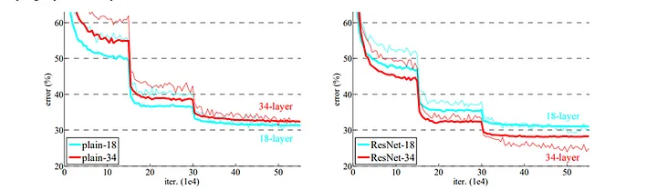

# The Investigation
This document contains the results of our investigations into each of the architectures, assessing their suitability for our specific requirements.
The candidates are the following:

- U-Net
- UNETR
- ResNet

## ResNet

### Sources and Useful Resources
- [Original paper](https://arxiv.org/abs/1512.03385)
- https://medium.com/@ibtedaazeem/understanding-resnet-architecture-a-deep-dive-into-residual-neural-network-2c792e6537a9
- https://en.wikipedia.org/wiki/Residual_neural_network
- https://cv-tricks.com/keras/understand-implement-resnets/

### Overview
ResNet is a deep learning model used for computer vision applications where the weight layers learn residual functions with reference to the layer inputs.

The key innovation consists in the introduction of residual connections (or skip connections). Whereas traditionally in neural networks, each layer tries to learn a specfic mapping from its input to its output, these connections allow the network to learn residual functions instead.

Thereby, the usual problem of vanishing gradients or degradation with increasing network depth is addressed by introducing the aforementioned residual connections, which bypass one or more layers. Instead of learning the mappings directly, it learns the residual mappings, which are the difference between the input and the output of the layer.

### History

### Residual Learning

The key component of ResNet is residual learning. In a normal neural network, the input would be transformed by a set of convolutional layers before being passed to the activation function. In a residual network however, the input to the block is added to the output of the block, creating a residual connection. We denote the output of the residual block as $H(x)$, where $x$ is the input. The output of $H(x)$ can be represented by:

$H(x) = F(x) + x$

$F(x)$ represents the residual mapping learned by the network. The presence of identity term $x$ allows the gradient to flow more easily.

### Complexity
ResNet comes in numerous variations such as ResNet-50 (the original architecture), ResNet-18, -34, -101, 110 and many more.

The number denotes the number of neural network layers in that specific architecture.

### Performance

The above figure shows the training/validation error rate after training on the dataset Imagenet. Left is a plain network, right is ResNet. The thick curve represents validation error, whereas the thin curve represents training error.